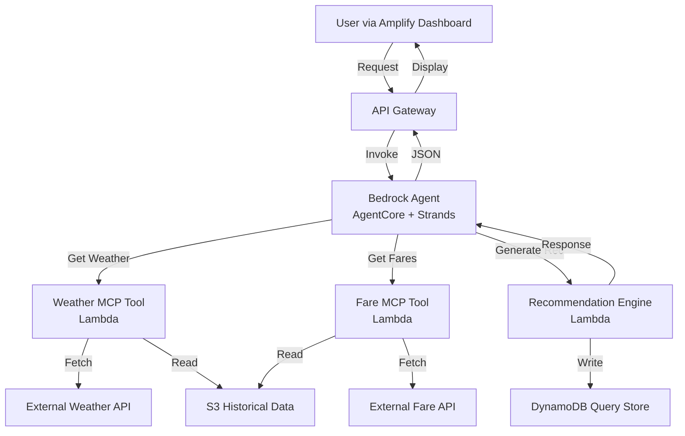

# Design Document: Weather-Wise Flight Booking Agent

## Overview

The Weather-Wise Flight Booking Agent is a serverless, event-driven system built on Amazon Bedrock's AgentCore with Strands orchestration. The agent integrates weather intelligence and flight fare analytics through MCP (Model Context Protocol) tools implemented as AWS Lambda functions. The system retrieves data from external APIs, processes it through risk assessment and recommendation algorithms, and exposes results via REST APIs for consumption by a web dashboard.

The architecture prioritizes:
- **Modularity**: Separate Lambda functions for weather, fare, and recommendation logic
- **Resilience**: Retry mechanisms and graceful degradation when data sources fail
- **Scalability**: Serverless components that scale automatically with demand
- **Traceability**: All queries and recommendations stored in DynamoDB for analysis

## Architecture

### High-Level Architecture



### Component Responsibilities

**Amazon Bedrock Agent (AgentCore with Strands)**:
- Orchestrates the workflow from user request to final recommendation
- Invokes MCP tools in the correct sequence
- Handles conversation context and multi-turn interactions
- Formats final response according to the standardized template

**API Gateway**:
- Exposes REST endpoints for the Amplify dashboard
- Validates incoming requests (destination, travel_window)
- Routes requests to the Bedrock Agent
- Returns JSON responses with appropriate HTTP status codes

**Weather MCP Tool (Lambda)**:
- Fetches weather forecasts from external weather API
- Retrieves seasonal climate risk data
- Accesses historical weather patterns from S3
- Returns structured weather data to the agent

**Fare MCP Tool (Lambda)**:
- Fetches current flight fare data from external fare API
- Retrieves 30-day historical fare trends from S3
- Calculates price movement percentages
- Returns structured fare trend data to the agent

**Recommendation Engine (Lambda)**:
- Receives weather risk and fare trend data
- Applies recommendation logic
- Identifies alternative travel windows when needed
- Stores query and recommendation in DynamoDB
- Returns final recommendation structure

**S3 Historical Data Store**:
- Stores historical weather patterns by destination and season
- Stores historical fare trends by route and time period
- Updated daily via scheduled batch jobs (out of scope for this spec)

**DynamoDB Query Store**:
- Stores user queries with destination, travel_window, timestamp
- Stores recommendations with weather_risk, fare_trend, booking_recommendation
- Configured with 90-day TTL for automatic cleanup
- Enables usage analytics and service improvement

## Components and Interfaces

### MCP Tool Interface

All MCP tools follow a standard interface contract:

```typescript
interface MCPToolRequest {
  tool_name: string;
  parameters: Record<string, any>;
}

interface MCPToolResponse {
  success: boolean;
  data?: any;
  error?: {
    code: string;
    message: string;
  };
}
```

### Weather MCP Tool

**Input Parameters**:
```typescript
interface WeatherToolInput {
  destination: string;        // IATA airport code or city name
  start_date: string;          // ISO 8601 format (YYYY-MM-DD)
  end_date: string;            // ISO 8601 format (YYYY-MM-DD)
}
```

**Output Data**:
```typescript
interface WeatherToolOutput {
  forecast: {
    date: string;
    temp_high: number;         // Celsius
    temp_low: number;          // Celsius
    precipitation_prob: number; // 0-100
    conditions: string;        // e.g., "Clear", "Rain", "Storms"
    wind_speed: number;        // km/h
    humidity: number;          // 0-100
    visibility: number;        // km
  }[];
  climate_risks: {
    storms: boolean;
    heavy_rain: boolean;
    extreme_heat: boolean;
    monsoon: boolean;
    poor_visibility: boolean;
  };
  historical_disruption_rate: number; // 0-100, percentage of flights disrupted historically
}
```

**Implementation**:
- Calls external weather API (e.g., OpenWeatherMap, WeatherAPI.com)
- Queries S3 for historical disruption rates by destination and season
- Combines forecast and historical data
- Returns structured response

### Fare MCP Tool

**Input Parameters**:
```typescript
interface FareToolInput {
  origin: string;              // IATA airport code
  destination: string;         // IATA airport code
  start_date: string;          // ISO 8601 format
  end_date: string;            // ISO 8601 format
}
```

**Output Data**:
```typescript
interface FareToolOutput {
  current_price: number;       // USD
  price_30d_ago: number;       // USD
  price_trend: "rising" | "stable" | "dropping";
  trend_percentage: number;    // Positive for rising, negative for dropping
  price_history: {
    date: string;
    price: number;
  }[];
}
```

**Implementation**:
- Calls external fare API (e.g., Skyscanner, Amadeus)
- Queries S3 for 30-day historical fare data
- Calculates trend percentage: `((current - 30d_ago) / 30d_ago) * 100`
- Classifies trend based on percentage thresholds
- Returns structured response

### Recommendation Engine

**Input Parameters**:
```typescript
interface RecommendationInput {
  query_id: string;
  destination: string;
  travel_window: {
    start_date: string;
    end_date: string;
  };
  weather_data: WeatherToolOutput;
  fare_data: FareToolOutput;
}
```

**Output Data**:
```typescript
interface RecommendationOutput {
  weather_risk: "Low" | "Medium" | "High";
  weather_risk_explanation: string;
  comfort_advisory: string;
  fare_trend_insight: string;
  booking_recommendation: "Book Now" | "Wait" | "Change Dates";
  recommendation_rationale: string;
  alternative_windows?: {
    start_date: string;
    end_date: string;
    weather_risk: "Low" | "Medium" | "High";
    fare_trend: "rising" | "stable" | "dropping";
    summary: string;
  }[];
}
```

**Implementation**:
- Calculates weather risk level using disruption probability and climate risks
- Generates comfort advisory from temperature, precipitation, and conditions
- Applies recommendation logic based on weather risk and fare trend
- Searches for alternative windows when recommending "Change Dates"
- Stores query and recommendation in DynamoDB
- Returns structured recommendation

### API Gateway Endpoints

**POST /recommend**

Request:
```json
{
  "destination": "LAX",
  "origin": "JFK",
  "travel_window": {
    "start_date": "2024-07-15",
    "end_date": "2024-07-22"
  }
}
```

Response (Success - 200):
```json
{
  "query_id": "uuid-v4",
  "weather_risk": "Low",
  "weather_risk_explanation": "Clear skies expected with minimal disruption risk (8%)",
  "comfort_advisory": "Pleasant temperatures 22-28°C, low humidity, ideal travel conditions",
  "fare_trend_insight": "Prices rising 15% over past 30 days - book soon to lock in rates",
  "booking_recommendation": "Book Now",
  "recommendation_rationale": "Low weather risk and rising fares make this an optimal time to book",
  "alternative_windows": null
}
```

Response (Error - 400):
```json
{
  "error": {
    "code": "INVALID_REQUEST",
    "message": "Missing required parameter: destination"
  }
}
```

Response (Error - 500):
```json
{
  "error": {
    "code": "SERVICE_UNAVAILABLE",
    "message": "Weather data unavailable. Please try again later."
  }
}
```

## Data Models

### DynamoDB Schema

**Table Name**: `weather-wise-queries`

**Primary Key**: 
- Partition Key: `query_id` (String, UUID)

**Attributes**:
```typescript
interface QueryRecord {
  query_id: string;              // UUID v4
  timestamp: number;             // Unix timestamp
  destination: string;           // IATA code or city
  origin: string;                // IATA code
  travel_window_start: string;   // ISO 8601
  travel_window_end: string;     // ISO 8601
  weather_risk: string;          // "Low" | "Medium" | "High"
  fare_trend: string;            // "rising" | "stable" | "dropping"
  booking_recommendation: string; // "Book Now" | "Wait" | "Change Dates"
  ttl: number;                   // Unix timestamp (90 days from creation)
}
```

**Indexes**:
- GSI: `destination-timestamp-index` for querying by destination over time

### S3 Data Structure

**Bucket**: `weather-wise-historical-data`

**Weather Historical Data**:
- Path: `weather/{destination}/{year}/{month}/disruption_rates.json`
- Content: Historical flight disruption rates by weather conditions

**Fare Historical Data**:
- Path: `fares/{origin}-{destination}/{year}/{month}/daily_prices.json`
- Content: Daily fare snapshots for route analysis

## Algorithms

### Weather Risk Calculation

The weather risk level is determined by combining disruption probability with specific climate risks:

```
Algorithm: CalculateWeatherRisk(weather_data)

Input: weather_data (WeatherToolOutput)
Output: risk_level ("Low" | "Medium" | "High"), explanation (string)

1. disruption_prob = weather_data.historical_disruption_rate
2. climate_risks = weather_data.climate_risks
3. severe_risk_detected = climate_risks.storms OR 
                          climate_risks.heavy_rain OR 
                          climate_risks.extreme_heat OR 
                          climate_risks.monsoon OR 
                          climate_risks.poor_visibility

4. IF disruption_prob > 40 OR severe_risk_detected THEN
     risk_level = "High"
     explanation = "High disruption risk (" + disruption_prob + "%) with " + 
                   ListActivatedRisks(climate_risks)
   ELSE IF disruption_prob >= 15 AND disruption_prob <= 40 THEN
     risk_level = "Medium"
     explanation = "Moderate disruption risk (" + disruption_prob + "%)"
   ELSE
     risk_level = "Low"
     explanation = "Minimal disruption risk (" + disruption_prob + "%)"

5. RETURN (risk_level, explanation)
```

### Comfort Score Calculation

The comfort advisory is generated by analyzing temperature, precipitation, and other conditions:

```
Algorithm: GenerateComfortAdvisory(weather_data)

Input: weather_data (WeatherToolOutput)
Output: advisory (string)

1. avg_temp = Average(forecast.temp_high + forecast.temp_low) / 2 for all days
2. max_precip_prob = Max(forecast.precipitation_prob) for all days
3. avg_humidity = Average(forecast.humidity) for all days

4. comfort_factors = []

5. IF avg_temp < 10 THEN
     comfort_factors.append("Cold temperatures (" + avg_temp + "°C) - pack warm clothing")
   ELSE IF avg_temp > 35 THEN
     comfort_factors.append("Extreme heat (" + avg_temp + "°C) - stay hydrated")
   ELSE IF avg_temp >= 18 AND avg_temp <= 26 THEN
     comfort_factors.append("Pleasant temperatures (" + avg_temp + "°C)")
   ELSE
     comfort_factors.append("Temperatures " + avg_temp + "°C")

6. IF max_precip_prob > 70 THEN
     comfort_factors.append("High chance of rain - bring umbrella")
   ELSE IF max_precip_prob > 40 THEN
     comfort_factors.append("Possible rain showers")

7. IF avg_humidity > 80 THEN
     comfort_factors.append("High humidity - may feel uncomfortable")

8. advisory = Join(comfort_factors, ", ")
9. RETURN advisory
```

### Fare Trend Classification

Fare trends are classified based on 30-day price movement:

```
Algorithm: ClassifyFareTrend(fare_data)

Input: fare_data (FareToolOutput)
Output: trend ("rising" | "stable" | "dropping"), insight (string)

1. current = fare_data.current_price
2. baseline = fare_data.price_30d_ago
3. change_pct = ((current - baseline) / baseline) * 100

4. IF change_pct > 10 THEN
     trend = "rising"
     insight = "Prices rising " + Round(change_pct) + "% over past 30 days - book soon"
   ELSE IF change_pct < -10 THEN
     trend = "dropping"
     insight = "Prices dropping " + Round(Abs(change_pct)) + "% - consider waiting"
   ELSE
     trend = "stable"
     insight = "Prices stable (±" + Round(Abs(change_pct)) + "%) over past 30 days"

5. RETURN (trend, insight)
```

### Booking Recommendation Logic

The final recommendation combines weather risk and fare trend:

```
Algorithm: GenerateBookingRecommendation(weather_risk, fare_trend)

Input: weather_risk ("Low" | "Medium" | "High")
       fare_trend ("rising" | "stable" | "dropping")
Output: recommendation ("Book Now" | "Wait" | "Change Dates")
        rationale (string)

1. IF weather_risk == "High" THEN
     recommendation = "Change Dates"
     rationale = "High weather risk makes travel unsafe - consider alternative dates"
     RETURN (recommendation, rationale)

2. IF weather_risk == "Medium" AND fare_trend != "dropping" THEN
     recommendation = "Change Dates"
     rationale = "Moderate weather risk with " + fare_trend + " fares - safer dates recommended"
     RETURN (recommendation, rationale)

3. IF weather_risk == "Low" AND fare_trend == "dropping" THEN
     recommendation = "Wait"
     rationale = "Low weather risk and dropping fares - wait for better prices"
     RETURN (recommendation, rationale)

4. IF weather_risk == "Low" AND (fare_trend == "rising" OR fare_trend == "stable") THEN
     recommendation = "Book Now"
     rationale = "Low weather risk and " + fare_trend + " fares - good time to book"
     RETURN (recommendation, rationale)

5. IF weather_risk == "Medium" AND fare_trend == "dropping" THEN
     recommendation = "Wait"
     rationale = "Moderate weather risk but dropping fares - monitor both factors"
     RETURN (recommendation, rationale)

6. // Default fallback
   recommendation = "Book Now"
   rationale = "Conditions acceptable for booking"
   RETURN (recommendation, rationale)
```

### Alternative Window Search

When recommending "Change Dates", the system searches for better options:

```
Algorithm: FindAlternativeWindows(original_start, original_end, destination, origin)

Input: original_start (date), original_end (date), destination (string), origin (string)
Output: alternatives (list of AlternativeWindow)

1. window_duration = DaysBetween(original_start, original_end)
2. search_range = 14 days before and after original_start
3. candidates = []

4. FOR each_date IN search_range DO
     candidate_start = each_date
     candidate_end = each_date + window_duration
     
     IF candidate_start == original_start THEN
       CONTINUE  // Skip the original window
     
     weather_data = CallWeatherMCPTool(destination, candidate_start, candidate_end)
     fare_data = CallFareMCPTool(origin, destination, candidate_start, candidate_end)
     
     weather_risk = CalculateWeatherRisk(weather_data)
     fare_trend = ClassifyFareTrend(fare_data)
     
     score = CalculateWindowScore(weather_risk, fare_trend)
     
     candidates.append({
       start: candidate_start,
       end: candidate_end,
       weather_risk: weather_risk,
       fare_trend: fare_trend,
       score: score
     })

5. Sort candidates by score (descending)
6. alternatives = Take top 3 from candidates
7. RETURN alternatives

Function CalculateWindowScore(weather_risk, fare_trend):
  score = 0
  
  IF weather_risk == "Low" THEN score += 100
  ELSE IF weather_risk == "Medium" THEN score += 50
  ELSE score += 0
  
  IF fare_trend == "dropping" THEN score += 30
  ELSE IF fare_trend == "stable" THEN score += 20
  ELSE score += 10
  
  RETURN score
```

## Error Handling

### Retry Strategy

All MCP tool invocations implement exponential backoff retry:

```
Algorithm: InvokeMCPToolWithRetry(tool_name, parameters)

Input: tool_name (string), parameters (object)
Output: response (MCPToolResponse)

1. max_retries = 2
2. base_delay = 1000  // milliseconds
3. attempt = 0

4. WHILE attempt <= max_retries DO
     TRY
       response = InvokeMCPTool(tool_name, parameters)
       IF response.success THEN
         RETURN response
       ELSE
         THROW Error(response.error.message)
     CATCH error
       attempt += 1
       IF attempt > max_retries THEN
         RETURN {
           success: false,
           error: {
             code: "MAX_RETRIES_EXCEEDED",
             message: "Failed to invoke " + tool_name + " after " + max_retries + " retries"
           }
         }
       delay = base_delay * (2 ^ (attempt - 1))
       Sleep(delay)

5. // Should never reach here
   RETURN error response
```

### Graceful Degradation

When data sources are partially unavailable:

```
Algorithm: HandlePartialDataFailure(weather_result, fare_result)

Input: weather_result (MCPToolResponse), fare_result (MCPToolResponse)
Output: recommendation (RecommendationOutput) OR error (ErrorResponse)

1. IF weather_result.success AND fare_result.success THEN
     // Normal path - both data sources available
     RETURN GenerateFullRecommendation(weather_result.data, fare_result.data)

2. IF weather_result.success AND NOT fare_result.success THEN
     // Weather-only recommendation
     recommendation = GenerateWeatherOnlyRecommendation(weather_result.data)
     recommendation.disclaimer = "Fare data unavailable - recommendation based on weather only"
     RETURN recommendation

3. IF fare_result.success AND NOT weather_result.success THEN
     // Fare-only recommendation
     recommendation = GenerateFareOnlyRecommendation(fare_result.data)
     recommendation.disclaimer = "Weather data unavailable - recommendation based on fares only"
     RETURN recommendation

4. IF NOT weather_result.success AND NOT fare_result.success THEN
     // Both failed - return error
     RETURN {
       error: {
         code: "DATA_UNAVAILABLE",
         message: "Both weather and fare data are currently unavailable. Please try again later."
       }
     }
```

### Input Validation

Before processing requests:

```
Algorithm: ValidateRequest(request)

Input: request (object with destination, origin, travel_window)
Output: validation_result (boolean), error_message (string)

1. IF NOT request.destination THEN
     RETURN (false, "Missing required parameter: destination")

2. IF NOT request.origin THEN
     RETURN (false, "Missing required parameter: origin")

3. IF NOT request.travel_window OR 
      NOT request.travel_window.start_date OR 
      NOT request.travel_window.end_date THEN
     RETURN (false, "Missing required parameter: travel_window with start_date and end_date")

4. start = ParseDate(request.travel_window.start_date)
5. end = ParseDate(request.travel_window.end_date)
6. today = CurrentDate()

7. IF start < today THEN
     RETURN (false, "Travel window start_date must be in the future")

8. IF end < start THEN
     RETURN (false, "Travel window end_date must be after start_date")

9. IF DaysBetween(start, end) > 30 THEN
     RETURN (false, "Travel window cannot exceed 30 days")

10. IF NOT IsValidIATACode(request.destination) AND NOT IsValidCity(request.destination) THEN
      RETURN (false, "Invalid destination: must be IATA code or recognized city name")

11. IF NOT IsValidIATACode(request.origin) THEN
      RETURN (false, "Invalid origin: must be IATA airport code")

12. RETURN (true, null)
```

## Response Formatting

The agent formats all responses using the standardized template:

```
Template: FormatResponse(recommendation)

Input: recommendation (RecommendationOutput)
Output: formatted_text (string)

formatted_text = "
🌦️ Weather Risk Summary: {recommendation.weather_risk}
{recommendation.weather_risk_explanation}

🌡️ Comfort & Climate Advisory:
{recommendation.comfort_advisory}

💰 Fare Trend Insight:
{recommendation.fare_trend_insight}

✅ Final Booking Recommendation: {recommendation.booking_recommendation}
{recommendation.recommendation_rationale}
"

IF recommendation.alternative_windows EXISTS AND NOT EMPTY THEN
  formatted_text += "
🔁 Alternative Travel Windows:
"
  FOR EACH window IN recommendation.alternative_windows DO
    formatted_text += "
• {window.start_date} to {window.end_date}
  Weather Risk: {window.weather_risk} | Fare Trend: {window.fare_trend}
  {window.summary}
"

RETURN formatted_text
```


## Correctness Properties

A property is a characteristic or behavior that should hold true across all valid executions of a system—essentially, a formal statement about what the system should do. Properties serve as the bridge between human-readable specifications and machine-verifiable correctness guarantees.

### Property 1: MCP Tool Invocation Completeness

*For any* valid user request with destination and travel window, the Agent should invoke all required MCP tools (weather forecast, climate risks, and fare trends) with the correct parameters before generating a recommendation.

**Validates: Requirements 1.1, 1.2, 1.3**

### Property 2: Historical Data Access

*For any* request requiring historical context, the Agent should access S3 datasets for both historical weather patterns and fare trends relevant to the destination and route.

**Validates: Requirements 1.4**

### Property 3: Query Persistence

*For any* processed user query, the Agent should write a complete record to DynamoDB containing query_id, timestamp, destination, origin, travel_window, weather_risk, fare_trend, booking_recommendation, and TTL set to 90 days from creation.

**Validates: Requirements 1.5, 9.1, 9.2, 9.3, 9.5**

### Property 4: MCP Tool Failure Handling

*For any* MCP tool invocation that fails, the Agent should log the error and return a descriptive error message to the user.

**Validates: Requirements 1.6**

### Property 5: Climate Risk Evaluation Completeness

*For any* weather data retrieved, the Agent should evaluate all specified climate risk types: storms, heavy rain, extreme heat, monsoon impact, and poor visibility.

**Validates: Requirements 2.1**

### Property 6: Disruption Probability Calculation

*For any* weather data with historical patterns and forecast severity, the Agent should calculate a disruption probability value between 0 and 100 percent.

**Validates: Requirements 2.2**

### Property 7: Weather Risk Classification

*For any* calculated disruption probability and climate risk evaluation, the Agent should classify weather risk as exactly one of Low, Medium, or High according to these rules: High when disruption probability exceeds 40% or severe climate risk is detected; Medium when disruption probability is between 15% and 40%; Low when disruption probability is below 15% and no significant climate risk is present.

**Validates: Requirements 2.3, 2.4, 2.5, 2.6**

### Property 8: Comfort Score Calculation Completeness

*For any* weather conditions analyzed, the Agent should calculate comfort score using all four factors: temperature, humidity, precipitation, and wind conditions.

**Validates: Requirements 3.1**

### Property 9: Climate Advisory Generation

*For any* weather conditions, the Agent should generate a climate advisory that identifies specific weather conditions impacting traveler comfort.

**Validates: Requirements 3.2**

### Property 10: Climate Advisory Completeness

*For any* generated climate advisory, the output should include temperature ranges, precipitation likelihood, and relevant weather warnings.

**Validates: Requirements 3.4**

### Property 11: Fare Analysis Window

*For any* fare data retrieval, the Agent should analyze price movements over exactly the past 30 days for the specified route.

**Validates: Requirements 4.1**

### Property 12: Fare Trend Classification

*For any* fare price change percentage, the Agent should classify the trend as exactly one of rising, stable, or dropping according to these rules: rising when price increased by more than 10%; stable when price variation is within ±10%; dropping when price decreased by more than 10%.

**Validates: Requirements 4.2, 4.3, 4.4, 4.5**

### Property 13: Fare Trend Context

*For any* completed fare analysis, the Agent should provide context about the price trend magnitude in the output.

**Validates: Requirements 4.6**

### Property 14: Booking Recommendation Logic

*For any* combination of weather risk (Low/Medium/High) and fare trend (rising/stable/dropping), the Agent should generate exactly one booking recommendation according to these rules: "Change Dates" when weather risk is High (regardless of fare trend); "Change Dates" when weather risk is Medium and fare trend is not dropping; "Wait" when weather risk is Low and fare trend is dropping; "Book Now" when weather risk is Low and fare trend is rising or stable; "Wait" when weather risk is Medium and fare trend is dropping.

**Validates: Requirements 5.1, 5.2, 5.3, 5.4, 5.5**

### Property 15: Alternative Window Generation

*For any* recommendation of "Change Dates", the Agent should identify and suggest alternative travel window options with better conditions.

**Validates: Requirements 5.6**

### Property 16: Alternative Window Search Range

*For any* original travel window when recommendation is "Change Dates", the Agent should analyze adjacent date ranges within 14 days before and after the original start date.

**Validates: Requirements 6.1**

### Property 17: Alternative Window Evaluation

*For any* alternative window analyzed, the Agent should evaluate both weather risk and fare trend for that window.

**Validates: Requirements 6.2**

### Property 18: Alternative Window Ranking

*For any* set of alternative windows found, the Agent should suggest at most three options ranked by combined weather safety and fare value score.

**Validates: Requirements 6.3**

### Property 19: Alternative Window Completeness

*For any* suggested alternative window, the Agent should provide both weather risk level and fare trend summary.

**Validates: Requirements 6.5**

### Property 20: Response Structure Completeness

*For any* generated response, the Agent should include all required sections with emoji indicators: Weather Risk Summary (🌦️), Comfort & Climate Advisory (🌡️), Fare Trend Insight (💰), Final Booking Recommendation (✅), and Alternative Travel Windows (🔁) when alternatives exist.

**Validates: Requirements 7.1, 7.2, 7.3, 7.4, 7.5, 7.6**

### Property 21: Response Content Restrictions

*For any* generated response text, the output should not contain explanations of AWS services or MCP protocol.

**Validates: Requirements 7.7**

### Property 22: API Response Format

*For any* generated recommendation, the API response should be valid JSON containing all required fields: weather_risk, comfort_advisory, fare_trend, booking_recommendation, and alternative_windows.

**Validates: Requirements 8.2, 8.3, 8.6**

### Property 23: Input Validation

*For any* incoming API request, the Agent should validate that required parameters (destination and travel_window with start_date and end_date) are present, destination is a recognized location, and travel_window contains valid future dates, returning HTTP 400 with descriptive error message if validation fails.

**Validates: Requirements 8.4, 8.5, 10.6, 10.7, 10.8**

### Property 24: DynamoDB Failure Resilience

*For any* DynamoDB write failure, the Agent should log the error but continue to return the recommendation to the user without failing the request.

**Validates: Requirements 9.4**

### Property 25: MCP Tool Retry with Exponential Backoff

*For any* MCP tool invocation that fails, the Agent should retry the request up to two additional times (three total attempts) with exponential backoff delays (1s, 2s).

**Validates: Requirements 10.1**

## Testing Strategy

### Dual Testing Approach

The Weather-Wise Flight Booking Agent will be validated using both unit tests and property-based tests:

**Unit Tests** focus on:
- Specific examples of weather risk calculations with known inputs and outputs
- Edge cases such as empty weather data, extreme temperatures, or 100% precipitation probability
- Error conditions like malformed API responses or network timeouts
- Integration points between Lambda functions and external APIs
- Specific scenarios from requirements (e.g., "no alternatives found" case from 6.4)
- Partial failure scenarios (weather-only, fare-only, complete failure from 10.3, 10.4, 10.5)

**Property-Based Tests** focus on:
- Universal properties that hold across all valid inputs
- Comprehensive input coverage through randomization
- Verification of classification algorithms across boundary conditions
- Validation of recommendation logic for all input combinations
- Each property test will run minimum 100 iterations

### Property-Based Testing Configuration

**Framework**: We will use `fast-check` for TypeScript/JavaScript Lambda functions (Node.js runtime on AWS Lambda).

**Test Configuration**:
- Minimum 100 iterations per property test
- Each test tagged with: `Feature: weather-wise-flight-booking, Property {N}: {property_text}`
- Tests organized by Lambda function (Weather Tool, Fare Tool, Recommendation Engine)

**Example Property Test Structure**:

```typescript
import fc from 'fast-check';

// Feature: weather-wise-flight-booking, Property 7: Weather Risk Classification
describe('Weather Risk Classification', () => {
  it('should classify risk correctly based on disruption probability and climate risks', () => {
    fc.assert(
      fc.property(
        fc.float({ min: 0, max: 100 }), // disruption_prob
        fc.record({
          storms: fc.boolean(),
          heavy_rain: fc.boolean(),
          extreme_heat: fc.boolean(),
          monsoon: fc.boolean(),
          poor_visibility: fc.boolean()
        }), // climate_risks
        (disruptionProb, climateRisks) => {
          const result = calculateWeatherRisk({ 
            historical_disruption_rate: disruptionProb,
            climate_risks: climateRisks,
            forecast: [] // simplified for example
          });
          
          const severeRisk = Object.values(climateRisks).some(v => v === true);
          
          if (disruptionProb > 40 || severeRisk) {
            expect(result.risk_level).toBe('High');
          } else if (disruptionProb >= 15 && disruptionProb <= 40) {
            expect(result.risk_level).toBe('Medium');
          } else {
            expect(result.risk_level).toBe('Low');
          }
          
          // Risk level must be one of the three valid values
          expect(['Low', 'Medium', 'High']).toContain(result.risk_level);
        }
      ),
      { numRuns: 100 }
    );
  });
});
```

### Test Organization

**Weather MCP Tool Tests**:
- Property 5: Climate Risk Evaluation Completeness
- Property 6: Disruption Probability Calculation
- Property 7: Weather Risk Classification
- Property 8: Comfort Score Calculation Completeness
- Property 9: Climate Advisory Generation
- Property 10: Climate Advisory Completeness

**Fare MCP Tool Tests**:
- Property 11: Fare Analysis Window
- Property 12: Fare Trend Classification
- Property 13: Fare Trend Context

**Recommendation Engine Tests**:
- Property 14: Booking Recommendation Logic
- Property 15: Alternative Window Generation
- Property 16: Alternative Window Search Range
- Property 17: Alternative Window Evaluation
- Property 18: Alternative Window Ranking
- Property 19: Alternative Window Completeness

**Agent Orchestration Tests**:
- Property 1: MCP Tool Invocation Completeness
- Property 2: Historical Data Access
- Property 3: Query Persistence
- Property 4: MCP Tool Failure Handling
- Property 20: Response Structure Completeness
- Property 21: Response Content Restrictions
- Property 22: API Response Format
- Property 23: Input Validation
- Property 24: DynamoDB Failure Resilience
- Property 25: MCP Tool Retry with Exponential Backoff

### Integration Testing

Integration tests will verify:
- End-to-end flow from API Gateway through Bedrock Agent to Lambda functions
- Actual calls to external weather and fare APIs (using test accounts)
- S3 data retrieval with sample historical datasets
- DynamoDB writes and TTL configuration
- Error propagation through the system layers

### Mocking Strategy

For unit and property tests:
- Mock external weather and fare APIs to control test data
- Mock S3 with in-memory historical data
- Mock DynamoDB with local DynamoDB instance or in-memory store
- Mock Bedrock Agent orchestration for Lambda function tests

For integration tests:
- Use real AWS services in a test environment
- Use test API keys for external services
- Use separate S3 bucket and DynamoDB table for test data
